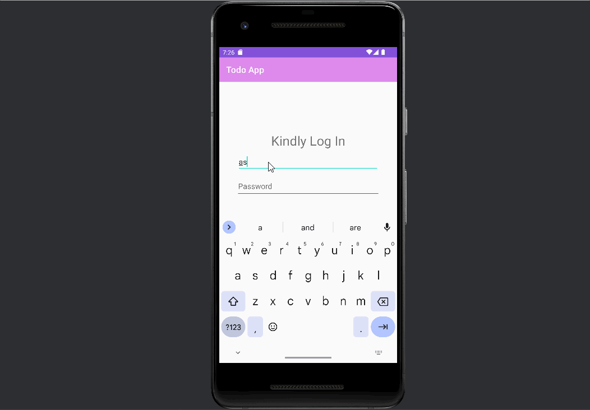

# To-Do-AppDMA
A TODO app allows users to create, read, update, and delete tasks in a list. The app uses a local Room database to store and retrieve tasks. Users can add new tasks using a form or dialog and the `Add` command, view all tasks using a RecyclerView or ListView, and edit tasks using a form or dialog and the `Update` command. The app also allows users to delete tasks using the `Delete` command. Optionally, the app may include a login feature to authenticate users before accessing their tasks.

